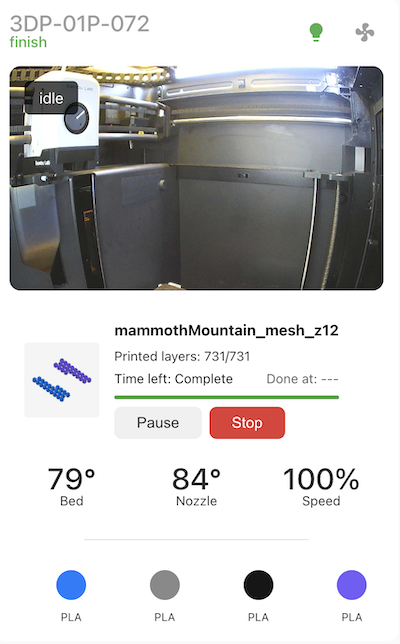

# PrintWatch Card

A feature-rich Home Assistant card for monitoring and controlling your P1S 3D printer. Get real-time updates on print progress, temperatures, material status, and more with a sleek, user-friendly interface.



## Features

- 🎥 Live camera feed with print status overlay
- 🌡️ Real-time temperature monitoring for bed and nozzle
- 📊 Print progress tracking with layer count and estimated completion time
- 🎨 AMS/Material status visualization
- 💡 Quick controls for chamber light and auxiliary fan
- ⏯️ Print control buttons (pause/resume/stop) with confirmation dialogs
- 🎛️ Speed profile monitoring
- 🖼️ Print preview image
- ⚡ Local API support

## Prerequisites

- Home Assistant
- P1S Printer integration configured in Home Assistant using [ha-bambulab]((https://github.com/greghesp/ha-bambulab)) plugin
- Required entities set up (see Configuration section)

## Installation

### HACS (Recommended)

1. Open HACS in Home Assistant
2. Click on "Frontend" section
3. Click the "+ Explore & Download Repositories" button
4. Search for "PrintWatch Card"
5. Click "Download"
6. Restart Home Assistant

### Manual Installation

1. Download the `printwatch-card.js`, `printwatch-card-editor.js`, and `printwatch-card-styles.js` files
2. Copy them to your `www/printwatch-card/` directory
3. Add the following to your dashboard resources:
   ```yaml
   resources:
     - url: /local/printwatch-card/printwatch-card.js
       type: module
     - url: /local/printwatch-card/printwatch-card-editor.js
       type: module
     - url: /local/printwatch-card/printwatch-card-styles.js
       type: module
   ```
4. Restart Home Assistant

## Configuration

Add the card to your dashboard with this basic configuration:

```yaml
type: custom:printwatch-card
printer_name_entity: sensor.p1s_printer_name
print_status_entity: sensor.p1s_print_status
current_stage_entity: sensor.p1s_current_stage
task_name_entity: sensor.p1s_task_name
progress_entity: sensor.p1s_print_progress
current_layer_entity: sensor.p1s_current_layer
total_layers_entity: sensor.p1s_total_layer_count
remaining_time_entity: sensor.p1s_remaining_time
bed_temp_entity: sensor.p1s_bed_temperature
nozzle_temp_entity: sensor.p1s_nozzle_temperature
speed_profile_entity: sensor.p1s_speed_profile
ams_slot1_entity: sensor.p1s_ams_tray_1
ams_slot2_entity: sensor.p1s_ams_tray_2
ams_slot3_entity: sensor.p1s_ams_tray_3
ams_slot4_entity: sensor.p1s_ams_tray_4
camera_entity: image.p1s_camera
cover_image_entity: image.p1s_cover_image
pause_button_entity: button.p1s_pause_printing
resume_button_entity: button.p1s_resume_printing
stop_button_entity: button.p1s_stop_printing
chamber_light_entity: light.p1s_chamber_light
aux_fan_entity: fan.p1s_aux_fan
```

### Configuration Options

| Option | Type | Default | Description |
|--------|------|---------|-------------|
| printer_name_entity | string | required | Entity ID for printer name |
| print_status_entity | string | required | Entity ID for print status |
| current_stage_entity | string | required | Entity ID for current stage |
| task_name_entity | string | required | Entity ID for task name |
| progress_entity | string | required | Entity ID for print progress |
| current_layer_entity | string | required | Entity ID for current layer |
| total_layers_entity | string | required | Entity ID for total layers |
| remaining_time_entity | string | required | Entity ID for remaining time |
| bed_temp_entity | string | required | Entity ID for bed temperature |
| nozzle_temp_entity | string | required | Entity ID for nozzle temperature |
| speed_profile_entity | string | required | Entity ID for speed profile |
| ams_slot1_entity | string | required | Entity ID for AMS slot 1 |
| ams_slot2_entity | string | required | Entity ID for AMS slot 2 |
| ams_slot3_entity | string | required | Entity ID for AMS slot 3 |
| ams_slot4_entity | string | required | Entity ID for AMS slot 4 |
| camera_entity | string | required | Entity ID for camera feed |
| cover_image_entity | string | required | Entity ID for print preview image |
| pause_button_entity | string | required | Entity ID for pause button |
| resume_button_entity | string | required | Entity ID for resume button |
| stop_button_entity | string | required | Entity ID for stop button |
| chamber_light_entity | string | required | Entity ID for chamber light |
| aux_fan_entity | string | required | Entity ID for auxiliary fan |

## Troubleshooting

### Common Issues

1. **Card not appearing**
   - Check that all required entities exist and are correctly named
   - Verify resources are properly loaded in HA

2. **Camera feed not updating**
   - Ensure camera entity is properly configured
   - Check that image updates are enabled in HA

3. **Controls not working**
   - Verify that your user has proper permissions for the entities
   - Check that button entities are available and not in an error state

## Contributing

Contributions are welcome! Please read our [Contributing Guide](CONTRIBUTING.md) for details on our code of conduct and the process for submitting pull requests.

## Support

If you're having issues, please:
1. Check the Troubleshooting section above
2. Search existing [GitHub issues](https://github.com/yourusername/printwatch-card/issues)
3. Create a new issue if your problem isn't already reported

## License

This project is licensed under the MIT License - see the [LICENSE](LICENSE) file for details.

## Acknowledgments

- [Greg Hesp](https://github.com/greghesp/ha-bambulab) maker of [ha-bambulab]((https://github.com/greghesp/ha-bambulab)) without this plugin wouldn't work
- Thanks to all P1S users who provided feedback and testing
- Inspired by the great Home Assistant community

---

