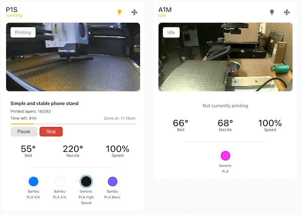
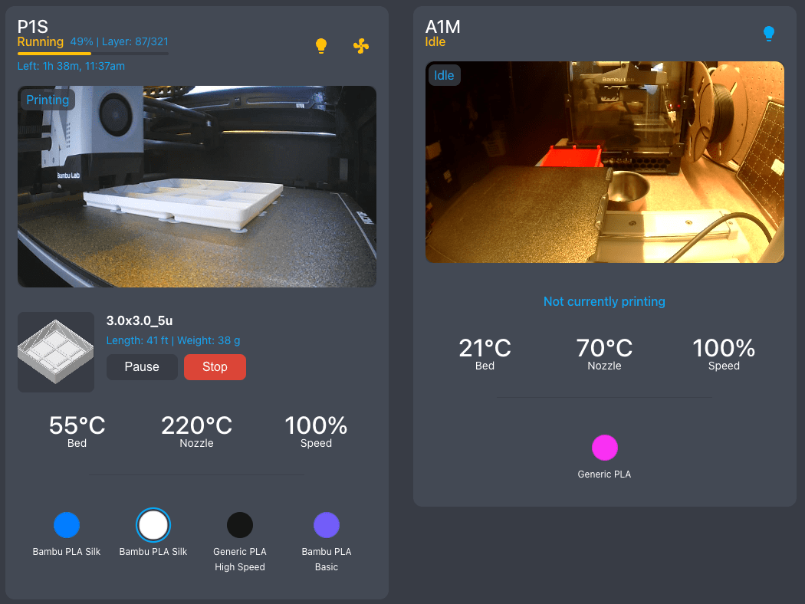
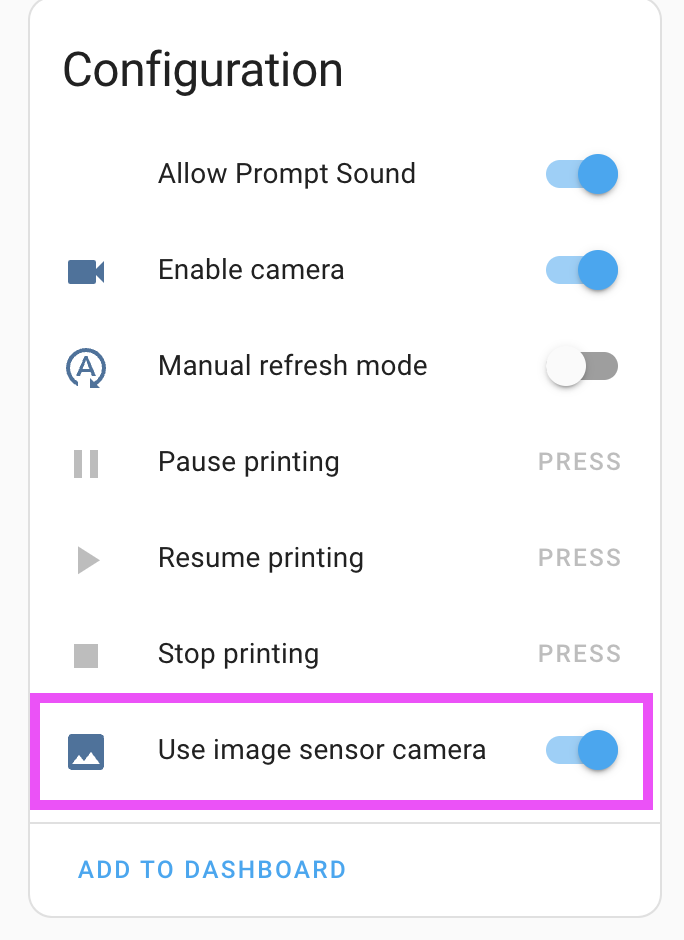

# PrintWatch Card

A feature-rich Home Assistant card for monitoring and controlling your P1S 3D printer. Get real-time updates on print progress, temperatures, material status, and more with a sleek, user-friendly interface.

### Light Mode 


### Dark Mode
  

### Theme Support Example


## Features

- 🎥 Live camera feed with configurable refresh rate
- 📊 Print progress tracking with layer count and estimated completion time
- 🎨 AMS/Material status visualization including current filament
- 💡 Quick controls for chamber light and auxiliary fan
- ⏯️ Print control buttons (pause/resume/stop) with confirmation dialogs
- 🎛️ Speed profile monitoring (controls to come)
- ⚡ Local API (LAN Mode)
- 🌑 Native Theme support
- 🌡️ Real-time temperature monitoring for bed and nozzle
- 📷 G-Code preview image (requires HA Bambu Lab plugin update)
- 🏷️ Display print weight and length details
-🌍 Localization support (initial translations in German, more contributions welcome!)

## Prerequisites

- Home Assistant
- P1S Printer integration configured in Home Assistant using [ha-bambulab]((https://github.com/greghesp/ha-bambulab)) plugin
- Required entities set up (see Configuration section)
- Image sensor toggle turned on




## Installation

### HACS (Recommended) - Awaiting approval from HACS, follow manual

1. Open HACS in Home Assistant
2. Click on "Frontend" section
3. Click the "+ Explore & Download Repositories" button
4. Search for "PrintWatch Card"
5. Click "Download"
6. Restart Home Assistant

### Manual Installation

1. Navigate to HACS
2. Tap 3 buttons in top right and select custom repositories
3. Paste `https://github.com/drkpxl/printwatch-card` and select `dashboard`
4. Save
5. Select printwatch-card in HACS listing and click download
6. Navigate to settings and install card if needed there.
7. Restart Home Assistant
8. Clear Browser cache if using previous version

## Configuration

Add the card to your dashboard with this basic configuration:


## Configuration

Add the card to your dashboard with this basic configuration:

```yaml
type: custom:printwatch-card
printer_name: P1S
camera_refresh_rate: 1000  # Refresh rate in milliseconds (1 second)
print_status_entity: sensor.p1s_print_status
current_stage_entity: sensor.p1s_current_stage
task_name_entity: sensor.p1s_task_name
progress_entity: sensor.p1s_print_progress
current_layer_entity: sensor.p1s_current_layer
total_layers_entity: sensor.p1s_total_layer_count
remaining_time_entity: sensor.p1s_remaining_time
bed_temp_entity: sensor.p1s_bed_temperature
nozzle_temp_entity: sensor.p1s_nozzle_temperature
speed_profile_entity: sensor.p1s_speed_profile
ams_slot1_entity: sensor.p1s_ams_tray_1
ams_slot2_entity: sensor.p1s_ams_tray_2
ams_slot3_entity: sensor.p1s_ams_tray_3
ams_slot4_entity: sensor.p1s_ams_tray_4
ams_slot5_entity: sensor.p1s_ams_tray_5
...
camera_entity: image.p1s_camera
cover_image_entity: image.p1s_cover_image
pause_button_entity: button.p1s_pause_printing
resume_button_entity: button.p1s_resume_printing
stop_button_entity: button.p1s_stop_printing
chamber_light_entity: light.p1s_chamber_light
aux_fan_entity: fan.p1s_aux_fan
print_weight_entity: sensor.p1s_print_weight
print_length_entity: sensor.p1s_print_length
```


## Troubleshooting

### Common Issues

1. **Card not appearing**
   - Check that all required entities exist and are correctly named
   - Verify resources are properly loaded in HA

2. **Camera feed not updating**
   - Ensure camera entity is properly configured
   - Check that image updates are enabled in HA
   - You must toggle on "use image sensor camera" in the ha-bambulab plugin


3. **Controls not working**
   - Verify that your user has proper permissions for the entities
   - Check that button entities are available and not in an error state

4. **G-Code preview not appearing**
   - Ensure you have the latest version of the HA Bambu Lab plugin
   - Enable G-Code preview in the plugin settings
5. **Localization issues**
   - Some translations are AI-generated; if you notice errors, consider submitting improvements!


## Contributing

Contributions are welcome! Please read our [Contributing Guide](CONTRIBUTING.md) for details on our code of conduct and the process for submitting pull requests.

## Support

If you're having issues, please:
1. Check the Troubleshooting section above
2. Search existing [GitHub issues](https://github.com/yourusername/printwatch-card/issues)
3. Create a new issue if your problem isn't already reported

## License

This project is licensed under the MIT License - see the [LICENSE](LICENSE) file for details.

## Acknowledgments

- [Greg Hesp](https://github.com/greghesp/ha-bambulab) maker of [ha-bambulab]((https://github.com/greghesp/ha-bambulab)) without this plugin wouldn't work
- Thanks to all P1S users who provided feedback and testing
- Inspired by the great Home Assistant community

---

If you find this useful I am addicted to good coffee.

<a href="https://www.buymeacoffee.com/drkpxl" target="_blank"></a>
